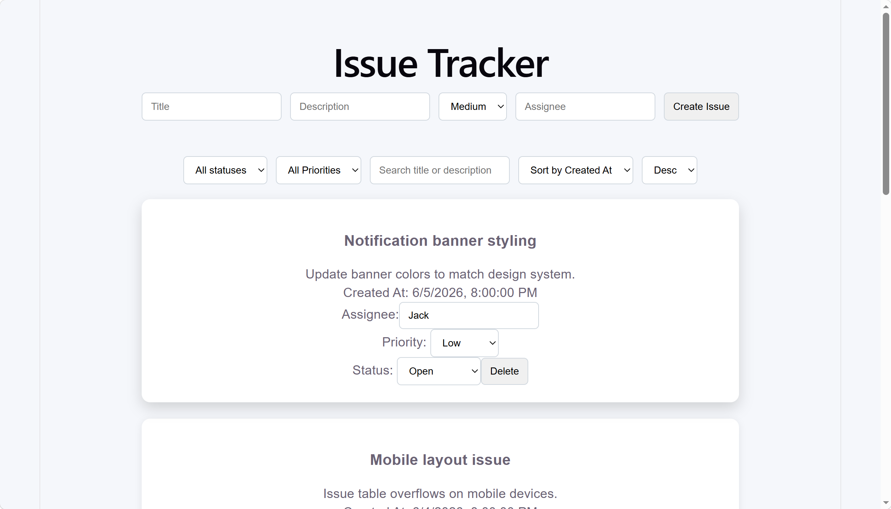
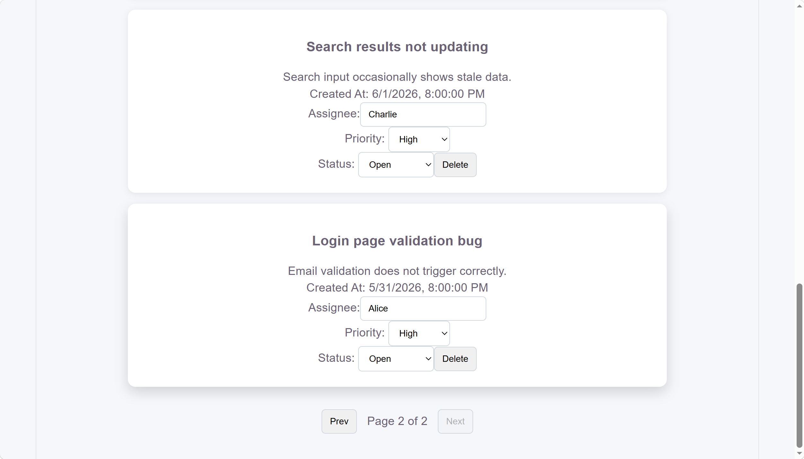
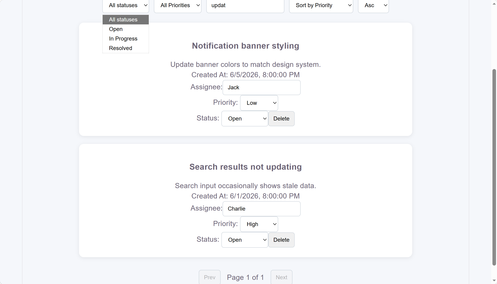
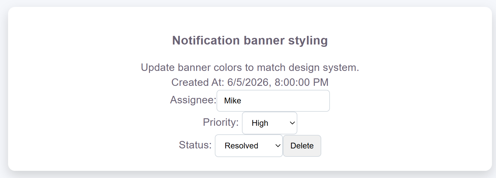

# Full-Stack Issue Tracker

A full-stack issue management application built with React, Vite, Node.js, and Express.

This project demonstrates common patterns used in modern web applications, including CRUD operations, filtering, pagination, debounced search, and optimistic UI updates.

---

## Features

### Issue Management

* Create new issues
* Update issue status
* Update issue priority
* Edit assignee information
* Delete existing issues

### Search & Filtering

* Filter by status
* Filter by priority
* Keyword search
* Debounced search input

### User Experience

* Optimistic UI updates
* Responsive interface
* Real-time table updates

### Backend APIs

* GET /api/issues
* POST /api/issues
* PATCH /api/issues/:id
* DELETE /api/issues/:id

---

## Tech Stack

### Frontend

* React
* Vite
* JavaScript
* CSS

### Backend

* Node.js
* Express

---

## Architecture

```text
React Frontend
       │
       ▼
REST API
       │
       ▼
Express Backend
       │
       ▼
In-Memory Data Store
```

---

## Screenshots

### Dashboard




### Search, Filter and Sorting



### Create Issue


### Update Issue



---

## Project Structure

```text
fullstack-issue-tracker
│
├── frontend
│   ├── src
│   ├── public
│   └── package.json
│
├── backend
│   ├── server.js
│   └── package.json
│
├── screenshots
│
└── README.md
```

---

## Getting Started

### Backend

```bash
cd backend
npm install
npm start
```

### Frontend

```bash
cd frontend
npm install
npm run dev
```

---

## Future Improvements

* Authentication and authorization
* Database persistence
* Role-based access control
* Real-time updates with WebSocket
* Automated testing

